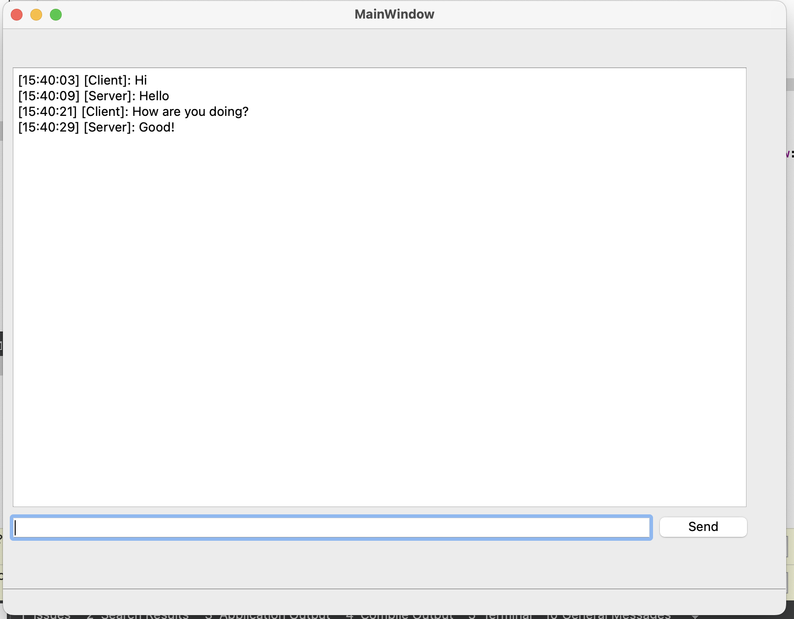
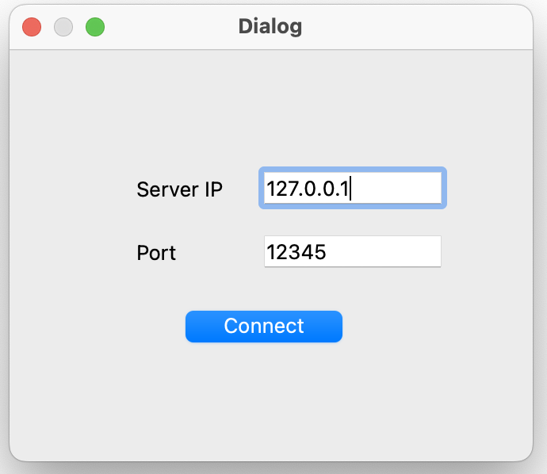
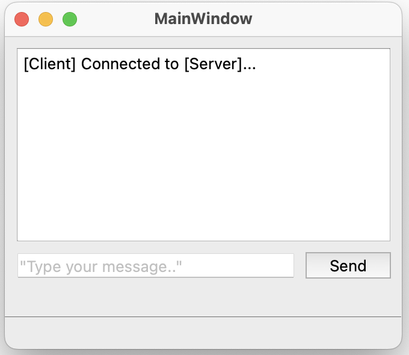

# 💬 Chat Application — Client & Server

A real-time, cross-platform chat system built using **Qt 6 Widgets** and **Boost.Asio (TCP protocol)**. This project features two standalone GUI applications — a server and a client — that enable efficient socket-based communication over LAN/Wi-Fi.

---

## 💻 Project Overview

This application demonstrates two-way messaging using asynchronous sockets and the **TCP communication protocol**, implemented with the Boost.Asio library. Messages are transmitted between users in real time with a GUI built using Qt Widgets, providing a seamless, responsive interface.

---

## 🛠️ Tech Stack

- **Language**: C++17
- **UI Framework**: Qt 6 (Widgets)
- **Networking**: Boost.Asio (TCP protocol)
- **Build System**: CMake
- **Platform**: macOS

---

## 📂 Project Structure

```
QtChatApp:
  ChatClientApp:                  # Qt GUI application for the chat client
    - CMakeLists.txt              # CMake configuration
    - main.cpp                    # Client app entry point
    - ConnectDialog.ui            # GUI layout for connection screen
    - ConnectDialog.cpp           # GUI logic for connection
    - ConnectDialog.h             # GUI connection class
    - Client.h                    # Client backend class
    - Client.cpp                  # Client backend logic
    - MainWindow.ui               # GUI layout for Client chat screen
    - MainWindow.h                # GUI class for Client chat
    - MainWindow.cpp              # GUI logic for client chat

  ChatServerApp:                  # Qt GUI application for the chat server
    - CMakeLists.txt              # CMake configuration
    - main.cpp                    # Server app entry point
    - MainWindow.ui               # GUI layout for Serve chat screen
    - MainWindow.cpp              # GUI logic and networking
    - MainWindow.h                # Server window class
    - Server.h                    # Server class
    - Server.cpp                  # Server class logic
    - Session.h                   # Session class
    - Session.cpp                 # Session class logic for handling multiple sessions

  screenshots/:                   # UI screenshots used in README

  README.md                       # Project documentation

```

---

## ✨ Features

✅ GUI-based server and client written in Qt  
✅ Two-way communication over TCP using Boost.Asio  
✅ Timestamped logs and scrollable message view  
✅ Auto-scroll behavior for new messages  
✅ Supports messaging across different devices on the same LAN  


---

## 📡 Communication Protocol

This chat system uses **Boost.Asio's asynchronous TCP sockets** to manage network communication. The server listens for client connections on a given port, while each client establishes a dedicated TCP connection to send and receive messages reliably.

---

## 📸 Screenshots

### 📡 Server Interface  


### 💬 Client Interface  
#### Client Connection

#### Client Chat


---

👨‍💻 Built by [Shabbir Khan](https://github.com/shabbir41)
